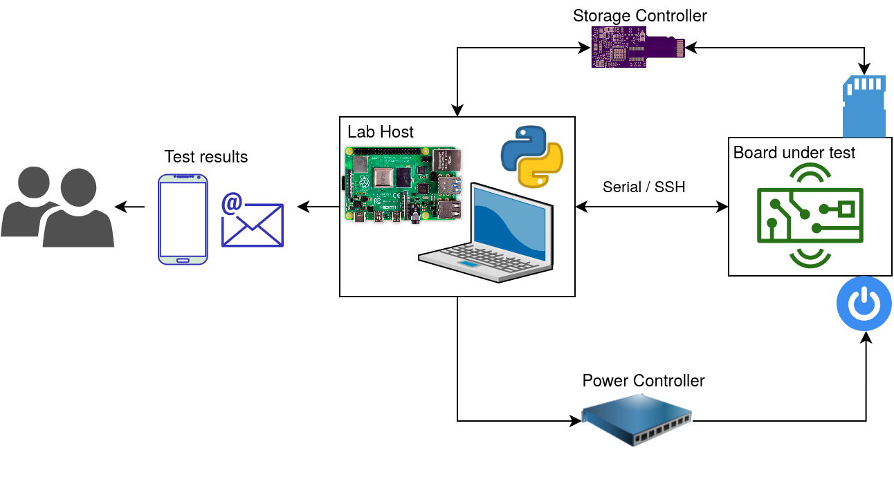

# Pluma Automation


Pluma Automation (formerly Automation Lab) is a tool created by [Witekio](https://www.witekio.com) to perform automated testing on embedded devices. This framework has no requirements on the device side. This tools is can be used in two different ways:

* As a command line interface tool (`pluma run`), designed with ease of use, and extensibility in mind
  * Relies on a target configuration file (`pluma-target.yml`) and a test definition file (`pluma.yml`)
* As python library, enabling programmatic hardware control of many supported devices to control a board's power, console, storage, and more
  * The main package for library use is named `pluma.core` (accessible as `pluma` top level package).

## Getting Started

Full documentation on [Read The Docs](https://pluma-automation.readthedocs.io/en/latest/)

## Installation

Pluma Automation can be run natively, or using Docker.

### Native

For native installation, just run the `install.sh` script.
This will install all the required system packages, then install the `pluma` python packages. This installer assumes you are running a debian based Linux distro, such as Ubuntu or Raspian.

```shell
./install.sh
```

### Docker container

To run with Docker you must first build the container.

```shell
make docker-build
```

**Note:** _For ARM based systems you must use the `docker-build-arm` target instead_.

Run the container with your project:

```shell
make docker-run-privileged PROJECT_DIR=/path/to/my/project PROJECT_SCRIPT=myscript.py
```

**Note:** _For ARM based systems you must use the `docker-run-privileged-arm` target instead_.

Where `PROJECT_DIR` is a directory containing all python scripts needed to run, and `PROJECT_SCRIPT` is the script to run from within that directory.
For more detailed instructions, see the [Install and Run](./docs/quick-start-guide/2-install-and-run.md) section of Quick Start Guide. Here you'll find instructions on how to run Pluma Automation with Docker.

## Using the command line interface

This device test framework can be used from a simple command line interface, [`pluma`](pluma/__main__.py), which can be used to easily define and run tests for an embedded device. Running tests can be done simply by running `pluma run`.

The following is a sample command line output when running tests from sample files:

```preformatted-text
pluma run -c pluma.yml.sample -t pluma-target.yml.sample
[ 0%] pluma.test.shelltest.ShellTest[target_setup] - test_body                PASS
[16%] pluma.test.shelltest.ShellTest[host_setup] - test_body                  PASS
[33%] pluma.test.shelltest.ShellTest[multiple_commands] - test_body           PASS
[50%] pluma.test.shelltest.ShellTest[cat_meminfo] - test_body                 PASS
[66%] testsuite.memory.MemorySize - test_body                                 PASS
[83%] pluma.test.shelltest.ShellTest[cleanup] - test_body                     PASS
All tests were successful.
```

It uses relies on two YAML configuration files:

* `pluma.yml`: Defines the tests sequence and parameters
* `pluma-target.yml`: Defines the device setup and settings: hardware used, credentials, serial, ssh.

The CLI provides the following sub commands:

* `pluma tests`: Show a list of the tests available and in use from the configuration
* `pluma check`: Validates the device and tests definition
* `pluma run`: Run the tests defined for the device
* `pluma clean`: Remove build files and built executables

The command line interface can also be accessed with `python3 -m pluma`, as `pluma` maps directly to this.

### Device definition YAML

The device definition file (pluma-target.yml) contains hardware and connectivity related information, used to interface and control the device.
This includes the console used, and how to control its power. A sample configuration is provided as [`pluma-target.yml.sample`](pluma-target.yml.sample).
A minimal configuration for serial could look like this:

```yml
#pluma-target.yml
console:
  serial:
    port: /dev/ttyUSB0
```

While a minimal configuration to connect via SSH would be:

```yml
#pluma-target.yml
system:
  prompt_regex: "\\S+@\\S+: "
  credentials:
    # Hardcoded credentials. Can be removed entirely if authenticating
    # with a public key
    login: root
    password: 12345

console:
  # Use an SSH connection to the target
  ssh:
    target: 192.168.0.25
```

Supported attributes:

* `system:` System configuration
  * `prompt_regex: <regex>` - The regex used to detected the system prompt
  * `credentials:` Credentials common to serial and SSH console
    * `login: <login>`
    * `password: <password>`

* `console:`
  * `serial:`
    * `port: <port>` - Serial port to the device, e.g. `/dev/ttyUSB0`
  * `ssh:`
    * `target: <ip/host>` - IP or hostname of the target device
    * `login: <login>` - SSH specific login
    * `password: <password>` - SSH specific password

* `variables:` User defined variables, substituted in the **tests configuration** (pluma.yml) file only.
  * `my_var: my_value` - A sample variable, usable as `${my_var}`

### Tests definition YAML

The tests definition (pluma.yml) contains all information related to the tests to be run on the target.
This includes the test list, their parameters, sequence of test and general test settings. A sample configuration is provided as [`pluma.yml.sample`](pluma.yml.sample).

The following is a basic tests definition example, that runs all tests in the order provided

```yml
#pluma.yml
settings:
  continue_on_fail: true
  iterations: 3

sequence:
# Power on, wait for prompt and login
- poweron:
- waitforpattern:
    pattern: 'login:'
    timeout: 20
- login:
# Run a series of tests
- shell_tests:
    host_setup:
      script: echo "setup host"
      run_on_host: true
    target_setup:
      script: echo "running on the device"
      # Wait 20s at most for the script to run
      timeout: 20
- core_tests:
    # Select tests from a suite of generic in `testsuite` folder.
    # Run all tests available under `testsuite.memory*`
    include: [testsuite.memory]
    parameters:
      # Pass parameters to a specific test
      testsuite.memory.MemorySize:
        total_mb: 985
        available_mb: 500
- c_tests:
    # Path to a Yocto SDK toolchain to be installed and used
    # to cross-compile
    yocto_sdk: /opt/yocto/oecore-x86_64-armv5-toolchain-nodistro.0.sh
    tests:
      # This will be cross-compiled, deployed, run, and removed, after
      # checking the return code.
      MyTestName:
        sources: [mytest_main.c]
- shell_tests:
    cleanup_on_device:
      # Run multiple commands
      script:
      - echo "doing some cleanup"
      - ls
      should_match_regex: ["doing some cleanup"]
```

The test run will fail if any of the tests or tasks run fail.

Supported attributes:

* `settings:`
  * `continue_on_fail: <bool>` - Continue or stop when a test/task fails
  * `iterations: <int>` - Number of times the test sequence is executed

* `sequence:` Ordered list of action to perform. Each elements can be one of [`shell_tests`, `core_test`, `c_tests`]. Elements can be repeated, but test names must be unique.
  * `- core_tests:` Test to be used from the common test suite
    * `include: <list_of_tests>` - Will match exact names, and tests starting from the name used. Full list of tests visible with `pluma tests` commands, and in the plugins folders (from `--plugin` CLI option).
    * `exclude: <list_of_test>` - Exclude tests, even if matched by `include`
    * `parameters`
      * `<testname>:` - Name of a test, must match its fully specified name, e.g. `testsuite.memory.MemorySize`. All the attributes under this will be directly passed to the test constructor. It is possible to use a YAML list of attributes to instantiate the test multiple times with different parameter sets.
  * `- shell_tests:` Script tests or tasks
    * `<testname>:`
      * `script: <string or list>` - Command(s) to run on the target
      * `should_match_regex: <list>` - List of expected outputs when running the command(s). Receiving all of these outputs will cause the test to pass.
      * `should_not_match_regex: <list>` - List of error outputs when running the command(s). Receiving any of these outputs will cause the test to fail.
      * `timeout: <timeout_in_seconds>` - Duration to wait for "silence" on the console after running a command. Will return earlier if the console stays silent.
      * `run_on_host: <bool>` - Run on the host or target device. Defaults to `false`.
      * `runs_in_shell: <bool>` - When a command runs it a shell, the return code is read and used to deduce success/failure of the command. Can be set to `false` to only send the command instead. Defaults to `true`.
      * `login_automatically: <bool>` - Will attempt to login automatically before sending any command. Can be set to `false` to prevent this behavior. Detaults to `true`.
  * `- c_tests:` Cross-compiled and deployed C tests or tasks
    * `yocto_sdk: <path_to_sdk>`
    * `tests:`
      * `<testname>:`
        * `sources: <list_of_source_files>` - Source files compiled for this test
        * `flags: <list_of_flags>` - Compilation flags
  * `- wait:` Wait for a specific duration
    * `duration: <wait_in_seconds>`
  * `- waitforpattern:` Wait for a specific pattern on the console
    * `pattern: <pattern>`
    * `timeout: <timeout_in_seconds>`
  * `- copytodevice:` Copies a single file to the target device
    * `file: <file_path>`
    * `destination: <device_target_path>`
    * `timeout: <timeout_in_seconds>`
  * `- login:` Attempt to login on the active console. Typically used for Serial
  * `- set:`
    * `device_console: <ssh/serial>` Set the default console to be used for communication with the device
  * `- poweron:` Use the power controller defined to power on the board
  * `- poweroff:` Use the power controller defined to power off the board
  * `- powercycle:` Use the power controller defined to power cycle the board (off and on)
    * `off_duration_ms:` Duration for which the device is powered off. Actual duration may be longer
  * `- manual_action:` Prints a message and wait for the user to press ENTER
    * `name: <test_name>` Optional test name
    * `message: <message>`
  * `- manual_test:` Prints a message, expected behavior, and wait user's feedback
    * `name: <test_name>` Optional test name
    * `message: <message>`
    * `expected: <expected_result>` The expected result the user should check

### Variables and substitution

Variables are used in both the target and tests configuration files as `${my_var}`. Variables can be defined either:
* In the target configuration
  * These are defined, under `variables` (see target definition), and substituted only in the tests configuration
* As environment environment variables
  * Environment variables always take precedence over target definition variables, and can be used in both the target, and test configuration files. These are typically set with `EXPORT my_var=value` on Linux platforms.

### Complete list of CLI options

```preformatted-text
usage: pluma [-h] [-v] [-q] [-c CONFIG] [-t TARGET] [--plugin PLUGIN] [-f] [--silent] [--debug]
                [{run,check,tests,clean,version}]

A lightweight automated testing tool for embedded devices.

positional arguments:
  {run,check,tests,clean,version}
                        command for pluma, defaults to "run".
                        "run": Run the tests suite,
                        "check": validate configuration files and tests,
                        "tests": list all tests available and selected,
                        "clean": remove logs,
                        toolchains, and built executables

optional arguments:
  -h, --help            show this help message and exit
  -v, --verbose         prints more information related to tests and progress
  -q, --quiet           print only test progress and results
  -c CONFIG, --config CONFIG
                        path to the tests configuration file. Default: "pluma.yml"
  -t TARGET, --target TARGET
                        path to the target configuration file. Default: "pluma-target.yml"
  --plugin PLUGIN       load plugin modules from directory path
  -f, --force           force operation instead of prompting
  --silent              silence all output
  --debug               enable debug information
```

### CLI Frequently Asked Questions

#### Is it possible to specify which device or test configuration to use?

Yes, use the CLI `-c <tests_config>` option to use a specific test configuration, or `-t <target_config>` option to use a specific device configuration file.

#### Is it possible to add custom tests?

Custom tests can be added as:

* Shell tests, directly in the test configuration file
* Compiled or C test, using the `c_tests` test provider, and passing the source files, and path to Yocto SDK
* Python tests, by creating a `<plugin_name>` folder with .py files, and creating test classes based on `TestBase` (see existing tests in the same folder for reference). These are specified with the `--plugin /path/to/my/plugin_dir` CLI option.

#### How to show the output of the commands ran?

Use the `-v` or `--verbose` flag when invoking `pluma run` in order to show the commands output.

#### Is it possible to run commands on the host?

Yes, you can use `run_on_host: true` inside a `shell_test` in order to run the command specified on the host machine.

```yml
- shell_test:
    script: echo 'echo from host!'
    run_on_host: true
```

#### Is it possible to run tests multiple times?

Yes, you can use the `iterations` setting in the test file to run the whole set of tests multiple times:

```yml
settings:
  iterations: 20
```

## Using the Python packages

### Features

System features include:

* [Automated testing framework](docs/tutorials/3-tutorial-test-framework.md)
* [A Docker container to run your tests in](docs/quick-start-guide/2-install-and-run.md)
* [Draw a plot of your USB tree](docs/tutorials/2-2-tutorial-usb.md)
* [Email reporting](docs/tutorials/4-1-tutorial-email.md)
* Flexible and extensible test scheduler
* Generate test reports with automatically formatted results and graphs
* Make and receive phone calls and text messages
* Read in-circuit voltage and current values

Hardware control features include:

* [Turn boards on and off remotely](docs/tutorials/2-3-tutorial-power.md)
* [Built-in boot test](docs/tutorials/2-5-tutorial-board.md)
* [Send commands to a board's console](docs/tutorials/2-5-tutorial-board.md)
* [USB relay control](docs/tutorials/2-3-tutorial-power.md)
* [SD card multiplexing](docs/tutorials/2-4-tutorial-storage.md)
* [Smart USB device detection](docs/tutorials/2-2-tutorial-usb.md)
* ... and much more!

Pluma Automation is designed to be easily extensible. If your smart plug, clever kettle, or hardware doodar isn't supported then you can probably integrate it without too much work.
Just be sure to raise a pull request with your shiny new feature ;).



### Overview

Pluma is composed of the following packages:
* `pluma.core` (or `pluma`): the library main package for hardware and device control
* `pluma.test`: a testing framework, which automates the hardware control to run testing of many flavours (regression, soak, feature, etc). This package is entirely optional.
`pluma.core` still works well without it, and can be easily integrated with other testing frameworks and CI/CD tools such as [Pytest](https://docs.pytest.org/) or [Buildbot](https://buildbot.net/).
* `pluma.utils`: a utilities library to provide additional features such as email reporting or downloading code from `git` repositories.

You can make use of these packages once you have installed Pluma, or within the Docker container.
```python
# my_project_file.py
from pluma import SerialConsole, Board
from pluma.core.power import Uhubctl

# Set up device control
console = SerialConsole(port='/dev/ttyUSB0', baud=115200)
power = Uhubctl(location='1-6.4', port=4)
my_board = Board('My board', console=console, power=power)

# Wait for it to boot
my_board.power.reboot()
my_board.console.wait_for_match(match='login:', timeout=60)
print(my_board.console.send_and_read('mendel'))
print(my_board.console.send_and_read('mendel'))
print(my_board.console.send_and_read('uname -a'))

# Turn the board off
my_board.power.off()
```

For more examples check out the [Tutorials](docs/tutorials/1-tutorial-introduction.md).
To get up and running quickly, check out the [Quick Start Guide](./docs/quick-start-guide/1-introduction.md).

## Running the Tests

The project's unit tests are split into two groups.
Those that do not require a specific hardware setup and those that do.

### Generic tests

You can run the project's hardware independent tests with:

```shell
make test
```

These do not require any hardware to be connected and should run on any Linux system that supports Python3.

### Hardware specific tests

The rest of the tests are expected to run on a Raspberry Pi 3/4 and require hardware peripherals to be connected in a specific way.

If you want to run the hardware tests as well, you will need to ensure that your Raspberry Pi's peripherals are connected as specified in the [test configuration file](./tests/rpi/hardware.json).
You can edit this file to match the way how your hardware is connected if needed.

You will also need to install the [RPi.GPIO](https://pypi.org/project/RPi.GPIO/) package, version 0.7.0 or newer.

```shell
pip3 install 'RPi.GPIO>=0.7.0'
```

Once you've done this you should be able to run the tests with:

```shell
make test-all
```

You will know if your hardware configuration is wrong as the relevant tests will fail.  
If you plan on using the tests to check your changes, it is recommended that you first verify that your hardware setup is correct by ensuring that all the tests pass.

## Contributing

If you would like to contribute to developing Pluma then check out our [Contributing Guide](./docs/how-to-contribute.md) to find out how.

We also have a code style guide for you to read before you begin development: [Style Guide](./docs/style-guide.md)

## Licensing

Pluma Automation is released under a [GPLv3 License](LICENSE.txt).
