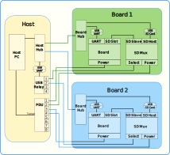

# Witekio Lab Quick Start Guide
This guide is intended to give an overview of the hardware and software in the Witekio Lab, and how to use it.  
For the purpose of this guide, we will use the Witekio UK farm as an example.

- [Witekio Lab Quick Start Guide](#witekio-lab-quick-start-guide)
    - [Farm Hardware Overview](#farm-hardware-overview)
        - [Farm host](#farm-host)
            - [Host PC](#host-pc)
            - [Host Hub](#host-hub)
            - [USB Relay](#usb-relay)
            - [PDU](#pdu)
        - [Farm Board](#farm-board)
            - [Board](#board)
            - [Board Hub](#board-hub)
            - [SD Mux](#sd-mux)
    - [Farm software overview](#farm-software-overview)
        - [Installation](#installation)
    - [Tutorials](#tutorials)
        - [Tutorial 1: Lab configuration files](#tutorial-1-lab-configuration-files)
        - [Tutorial 2: Adding a board to the farm](#tutorial-2-adding-a-board-to-the-farm)
        - [Tutorial 3: Writing a farm script](#tutorial-3-writing-a-farm-script)
        - [Tutorial 4: Sending commands over serial](#tutorial-4-sending-commands-over-serial)
        - [Tutorial 5: Using the SDMux to transfer files to a board](#tutorial-5-using-the-sdmux-to-transfer-files-to-a-board)
        - [Tutorial 6: Sending email reports](#tutorial-6-sending-email-reports)
---
## Farm Hardware Overview
In this section we will look at the hardware setup of the farm.

The hardware setup can roughly be divided into the following blocks:

- [Farm Host](#farm-host)
    - [Host PC](#host-pc)
    - [Host Hub](#host-hub)
    - [USB Relay](#usb-relay)
    - [PDU](#pdu)
- [Farm Board](#farm-board)
    - [Board](#board)
    - [Board Hub](#board-hub)
    - [SD Mux](#sd-mux)

  
*Hardware block diagram shows how each of the system components are connected.  
Only two boards are shown, but any number could be added.  
Only one PDU and USB Relay are pictured, but again, any number could be added.*

### Farm host
The farm host represents all of the hardware components that do not need a seperate instance for each board.

#### Host PC
The Host PC is the Linux machine that all other farm hardware is connected to and its responsibilities include:
- Controlling each boards hardware
- Creating and sending any data graphs and reports that are needed
- Handling remote access to the boards

#### Host Hub
This is the root USB hub to which all other farm related USB devices are connected.  
Most importantly, it acts as a common upstream USB device that each of the board hubs are connected to.  
Any USB devices that do not require a seperate instance per board are also connected to the Host PC via this hub.  
An example of one such device is a USB Relay, which has its serial port connected to the Host Hub via a UART to USB converter, as shown in the section [Farm Hardware Overview](#farm-hardware-overview).

#### USB Relay
This is a device that is conected to the [Host Hub](#host-hub).  
It has 4 output ports each of which comprise of a common line, and an A and B line.
By sending commands over serial, the common line of each output can be mechanically connected to either the A or B line.  
The model used by the Witekio Lab UK is the DLP-IOR4 by FTDI, and more detailed information can be found [here](http://www.ftdichip.com/Support/Documents/DataSheets/DLP/dlp-ior4-ds-v12.pdf).

In its current configuration, the farm uses this to toggle the select line of the [SD Mux](#sd-mux) connected to each board.  
However, this is by no means the only use for a USB Relay, and it could be used to switch any line up to a maximum power rating of 60W per relay.

#### PDU
The PDU is a switched rack Power Distribution Unit, to which each of the boards are connected.  
It is controlled over the network using the [Telnet protocol](https://en.wikipedia.org/wiki/Telnet), and is capible of indipendently controlling whether each of it's 8 output ports provide power.  
It's primary use is to allow a board to be turned on and off remotely via software.  
The model of PDU used in the Witekio Lab UK is the AP7920 by APC, and a manual can be found [here](http://www.apc.com/salestools/ASTE-6Z6K56/ASTE-6Z6K56_R0_EN.pdf).

### Farm Board
This represents all of the hardware that is required to have a seperate instance per board added to the farm.  

#### Board
The Board refers to our design under test.  
A common configuration for a board is to have an SD card slot for data storage, and a serial console for control. This therefore what the current iteration of the Witekio Lab's farm setup expects.  
The power supply of each board is connected to a port on the [PDU](#pdu) in order to allow it to be turned on and off remotely.

#### Board Hub
Each board has an associated board hub, to which all USB devices for interacting with that board are connected.  
The board hub should be connected upstream to the [Host Hub](#host-hub) in order to allow the [Host PC](#host-pc) to control the board.  
It is essential that one board hub is not connected downstream of another, as this causes issues for when automatically detecting which hardware is associated with a given board.  
Wherever a device is able connected via USB, it should be, as this allows a common interface for the [Host PC](#host-pc) to control the device.
For example, the serial port of each board is connected to the Board Hub via a UART to USB conversion cable.

#### SD Mux
This is a device which holds a micro SD Card, and is capible of switching it from being connected to its "slave" or "host" port, depending on the value of its "select" input.
The select line is toggled by using a [USB Relay](#usb-relay).

This is a custom device created by Witekio UK, but in future it may be replaced with off the shelf, or open source hardware.

Currently the power supply for each SD Mux is connected to the PDU. This is done in order to be able to reboot the device, should it experience functional issues.

---
## Farm software overview
In this section we will show how the hardware configuration of the farm is represented in software.

**[Software description and diagrams]**
**[UML class diagram to be automaticaally created from source and docstrings]**


### Installation
In this section we will look at how to download and install the Witekio Lab's farm scripts.


---
## Tutorials
In these tutorials we will demonstrate how to use the Witekio Lab's Python scripts.  
We will start with simple functionality, such as restarting a board, and work our way up to more complex functionality, such as sending email reports.

### Tutorial 1: Lab configuration files
In this tutorial we will look at:
- How the hardware configuration of a farm is represented in software

Below will walk through the creation of a hardware configuration file, using
the UK lab as an example.

The farm package includes the definitions of all farm hardware classes
```python
from farmcore import farm
```

Each [PDU](#pdu) in the farm is given a _PDU_ class instance.  
The UK farm currently only has one PDU installed, but any number could be
added as required.   
The PDU uses the telnet protocol, so _PDU_ class takes arguments for it's IP
address, and the telnet user login details to be used.
```python
pdu1 = farm.PDU(host='10.103.3.40', user='apc', pw='apc')
```

Each [USB Relay](#usb-relay) in the farm is given a _USBRelay_ class instance.  
The only argument required is the usb device path of the relay.
```python
ur1 = farm.USBRelay(usbpath='1-1.1.4.1')
ur2 = farm.USBRelay(usbpath='1-1.1.4.3')
```

Each [SD Mux](#sd-mux) in the farm is given an _SDMux_ class instance.  
The SD Mux is physically connected a [USB Relay](#usb-relay), and a [PDU](#pdu).  
Each class instance is therefore given a reference to these.
```python
sdm1 = farm.SDMux(ur_port=ur2[0], pdu_port=pdu1[2])
sdm2 = farm.SDMux(ur_port=ur2[3], pdu_port=pdu1[1])
sdm3 = farm.SDMux(ur_port=ur2[2], pdu_port=pdu1[3])
```

Each [board](#board) in the farm is represented and controlled by an instance of the
_Board_ class.  
In order for a board to be uniquely identified, it is given a name.  
Each board is physically connected a [PDU](#pdu), [SD Mux](#sd-mux), and its [Board Hub](#board-hub), therefore each class instance is given a reference to these.  
In this example we have one [Beaglebone Black](https://beagleboard.org/black) _'bbb'_, and two custom boards _'fb42'_ and _'fb43'_ in the farm.
The Beaglebone is connected to port 7 of PDU 1, SD Mux 1, and the Board Hub with usb debvice path _1-1.1.1_ .
```python
bbb  = farm.Board(name='bbb',  pdu_port=pdu1[7], hub='1-1.1.1', sdmux=sdm1)
fb42 = farm.Board(name='fb42', pdu_port=pdu1[4], hub='1-1.1.2', sdmux=sdm2)
fb43 = farm.Board(name='fb43', pdu_port=pdu1[6], hub='1-1.1.3', sdmux=sdm3)
```

This is the only configuration required the represent the hardware state of the farm.  
A user would import this hardware configuration in order to get a farm handle.  
This provides an entry point to start controlling the farm hardware.

_Note: Remember to replace "farm_uk" here with your hardware description filename._
```python
from farmconfigs.farm_uk import farm

b = farm.get_board('bbb')
```

We now have a handle to our board named _'bbb'_, and can use it to interact.  
We will start looking at how to use our newly acquired board handle in [Tutorial 3](#tutorial-3-writing-a-farm-script).

_See [tutorial_1.py](examples/tutorial_1.py) for the completed script._

### Tutorial 2: Adding a board to the farm
This section will look at the general practices in use at the Witekio Lab UK when adding new hardware to the farm.

In our implementation of the Witekio Lab we have lab maintainers, who are responsible for the upkeep and installation of boards. This reduces the likelihood of a normal user disturbing tests in progress on the boards currently in the farm.

If you only plan to use boards that are currently installed in the farm, then you may skip this section and move on to [Tutorial 2](#tutorial-3-writing-a-farm-script).

In this tutorial we will look at how to:
- The process of physically adding a new board to the farm
- How to modify the lab configuration file to represent this change

**[Tutorial content]**  
_See [tutorial_2.py](examples/tutorial_2.py) for the completed script._

### Tutorial 3: Writing a farm script
In this tutorial we will write a farm script to demonstrate the following:
- Set up our farm script environment
- Get a board instance
- Reboot the board

The expected way to interact with a board is to create a Python script that performs the required tasks.  
The rest of this section will focus on creating a simple script to turn a board off and on. In this example, we will assume that the Python scrips were extracted to '/home/my_user/farm-core'.  

The farm-core source is not packaged up and isn't intended to be installed as a system package.
Therefore we must add its location to the _PYTHONPATH_ variable so that the Python interpreter can pick it up.  

You can do this by setting the environment variable:
```bash
export PYTHONPATH=/home/my_user/farm-core
```

Alternatively, a simple way of doing this would be to add the following at the top of the script:
```python
import sys
sys.path.append('/home/my_user/farm-core')
```

In order to interact with the farm, we need to import our hardware configuration file:  
_Note: Remember to replace "farm_uk" here with your hardware description filename._
```python
from farmconfigs.farm_uk import farm
```

Next, we get a handle to the simple board class for the board named _'bbb'_.
```python
my_board = farm.get_board('bbb')
```

In order to gain exclusive use of a board, we must issue a use request.  
This will return an instance of the _FarmBoard_ class, with which we can interact with the board.
```python
my_farmboard = my_board.use()
```

Now that we have a _FarmBoard_, interacting with the hardware is simple.  
As an example, we will restart the board:
```python
my_farmboard.off()

my_farmboard.on()
```
Issuing these functions calls will cause the PDU connected the the board _'bbb'_ to turn its power port off and on.

_See [tutorial_3.py](examples/tutorial_3.py) for the completed script._

### Tutorial 4: Sending commands over serial
In this tutorial we will a basic farm script to demonstrate the following:
- Find a boards prompt
- Send a command over serial
- Wait for the command to finish execution
- Print the result

**[Tutorial content]**  
_See [tutorial_4.py](examples/tutorial_4.py) for the completed script._

### Tutorial 5: Using the SDMux to transfer files to a board
In this tutorial we will a basic farm script to demonstrate the following:
- Switch a board's SD card to the farm host
- Mount the SD card and copy a file to it
- Switch SD card back to the board
- Print the contents of the file over serial

**[Tutorial content]**  
_See [tutorial_5.py](examples/tutorial_5.py) for the completed script._

### Tutorial 6: Sending email reports
In this tutorial we will write a farm script to demonstrate the following:
- Copy a binary to a board
- Run the binary and store the result
- Email the result

**[Tutorial content]**  
_See [tutorial_6.py](examples/tutorial_6.py) for the completed script._
