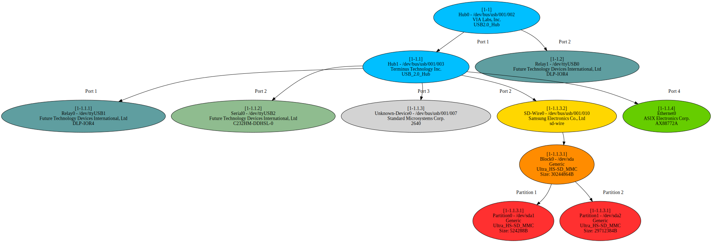

# Tutorial: Hardware Control - USB Devices

The majority of the devices that Pluma can control are USB based.
In this tutorial we'll view our USB tree, and look at how Pluma discovers USB devices.

All of our interaction with the USB tree is done via the `Hub` class, which represents a USB Hub.
The words "USB Hub" probably make you think of an external USB splitter of sorts, but we can also use the `Hub` class without one, as you'll see later.

While Pluma does have a `USB` class, this is just used for the low level system interaction and it's unlikely you'll need to look here.

## View USB tree

The easiest way to see what USB devices we have connected to our Pluma host is to plot them.

```python
from pluma.core import Hub

# Get a reference to USB Bus 1
usb_bus_1 = Hub('usb1')

# Display a plot of the USB tree
usb_bus_1.plot()
```

You should have a pop up window showing something like the image below.


You can see that on our test Pluma host we have 2 hubs, 2 USB Relays, 1 USB -> UART adaptor, 1 USB -> Ethernet adapter, 1 unsupported "Unknown" device, and an SD-Wire containing an SD card with 2 partitions.
What you see will depend on your system configuration.

Any device that shows up with a name that isn't "Unknown Device" can be controlled with a Pluma class.

The above example uses X11 to display the plot, so this may not work on some systems.

You can also save the plot to an image:

```python
# Display a plot of the USB tree
usb_bus_1.plot(image_file='usb_bus_1', image_format='png')
```

You can use this to view the USB tree of a remote machine by starting SSH with the X-forwarding flag (`-Y`):

```shell
dev@labhost:~ $ ssh -Y pi@raspberrypi.local

pi@raspberry:~ $ ipython3
...
In [1]: from pluma.core import Hub
In [2]: Hub('usb1').plot()
```

For a full list of available output formats see [Graphviz Output Formats](https://graphviz.org/doc/info/output.html).

## Understanding USB trees

The Linux kernel organises USB devices into a tree, found in sysfs at `/sys/bus/usb/devices`.

To see your USB tree you can use the `lsusb` tool:

```shell
pi@raspberry:~ $ lsusb --tree
/:  Bus 03.Port 1: Dev 1, Class=root_hub, Driver=dwc_otg/1p, 480M
/:  Bus 02.Port 1: Dev 1, Class=root_hub, Driver=xhci_hcd/4p, 5000M
/:  Bus 01.Port 1: Dev 1, Class=root_hub, Driver=xhci_hcd/1p, 480M
    |__ Port 1: Dev 2, If 0, Class=Hub, Driver=hub/4p, 480M
        |__ Port 1: Dev 3, If 0, Class=Hub, Driver=hub/4p, 480M
            |__ Port 1: Dev 5, If 0, Class=Vendor Specific Class, Driver=ftdi_sio, 12M
            |__ Port 2: Dev 12, If 0, Class=Vendor Specific Class, Driver=ftdi_sio, 480M
            |__ Port 3: Dev 7, If 0, Class=Hub, Driver=hub/3p, 480M
                |__ Port 1: Dev 9, If 0, Class=Mass Storage, Driver=usb-storage, 480M
                |__ Port 2: Dev 10, If 0, Class=Vendor Specific Class, Driver=, 12M
            |__ Port 4: Dev 8, If 0, Class=Vendor Specific Class, Driver=asix, 480M
        |__ Port 2: Dev 4, If 0, Class=Vendor Specific Class, Driver=ftdi_sio, 12M
```

The `tree` tool can also be used.

E.g. to view the tree for the USB 1 bus:

```shell
pi@raspberry:~ $ tree /sys/bus/usb/devices/usb1/ -d --matchdirs -P '*1-'

/sys/bus/usb/devices/usb1/
├── 1-0:1.0
│   └── usb1-port1
├── 1-1
│   ├── 1-1.1
│   │   ├── 1-1.1.1
│   │   │   ├── 1-1.1.1:1.0
│   │   │   │   └── ttyUSB1
│   │   ├── 1-1.1:1.0
│   │   │   ├── 1-1.1-port1
│   │   │   ├── 1-1.1-port2
│   │   │   ├── 1-1.1-port3
│   │   │   ├── 1-1.1-port4
│   │   ├── 1-1.1.2
│   │   │   ├── 1-1.1.2:1.0
│   │   │   │   └── ttyUSB2
│   │   ├── 1-1.1.3
│   │   │   ├── 1-1.1.3.1
│   │   │   │   ├── 1-1.1.3.1:1.0
│   │   │   │   │   ├── host0
│   │   │   │   │   │   └── target0:0:0
│   │   │   │   │   │       ├── 0:0:0:0
│   │   │   │   │   │       │   ├── block
│   │   │   │   │   │       │   │   └── sda
│   │   │   │   │   │       │   │       ├── sda1
│   │   │   │   │   │       │   │       ├── sda2
│   │   │   ├── 1-1.1.3:1.0
│   │   │   │   ├── 1-1.1.3-port1
│   │   │   │   ├── 1-1.1.3-port2
│   │   │   │   ├── 1-1.1.3-port3
│   │   │   ├── 1-1.1.3.2
│   │   │   ├── 1-1.1.3.2
│   │   │   │   ├── 1-1.1.3.2:1.0
│   │   ├── 1-1.1.4
│   │   │   ├── 1-1.1.4:1.0
│   │   │   │   ├── net
│   │   │   │   │   └── eth1
│   ├── 1-1:1.0
│   │   ├── 1-1-port1
│   │   ├── 1-1-port2
│   │   ├── 1-1-port3
│   │   ├── 1-1-port4
│   ├── 1-1.2
│   │   ├── 1-1.2:1.0
│   │   │   └── ttyUSB0
...

183 directories
```

The output shown above is cut down to emphasise the important details from what you'll actually see when you run that command.

The Linux kernel gives each USB device an address, defined by what USB bus and hubs it is connected to.

The generic address form is: `X-Y.Z:A.B`

Each field identifies where your device is connected within the USB tree.

- `X` is the number of the USB bus on the system
- `Y` is port number in use on that bus
- `Z` is optional and specifies the port number of a connected USB hub.
  - If a USB hub is connected to a port on another USB hub then a new number is added.
- `A` is the interface number (we're not interested in this)
- `B` is the configuration number  (we're not interested in this)

E.g.

`1-2` means port 2 on USB bus 1  
`1-2.3` means port 3 of a USB hub connected to port 2 of USB bus 1  
`1-2.3.4` means port 4 of a USB hub connected to port 3 of a USB hub connected to port 2 of USB bus 1

With this pattern in mind, look again at the plot of the USB tree in the previous section.
Looking at the device `Serial0` you'll see that it's USB address is `1-1.1.2`.
In other words, it's connected to port 2 of a USB hub connected to port 1 of a USB hub connected to port 1 of USB bus 1.

In the plot you'll also see that `Block0`, `Partition0`, and `Partition1` all share the same USB address (`1-1.1.3.1`).
This is because they are all the same device on the USB bus, but with different interface and configuration numbers, although these are not shown in the diagram.

## How to find a device's USB address

The easiest way is probably to watch the Linux kernel log while plugging the device in.

```shell
pi@raspberry:~ $ dmesg -w
** Plugged in USB relay***

[1388395.063692] usb 1-1.2: new full-speed USB device number 13 using xhci_hcd
[1388395.209362] usb 1-1.2: New USB device found, idVendor=0403, idProduct=6001, bcdDevice= 6.00
[1388395.209378] usb 1-1.2: New USB device strings: Mfr=1, Product=2, SerialNumber=3
[1388395.209390] usb 1-1.2: Product: DLP-IOR4
[1388395.209403] usb 1-1.2: Manufacturer: DLP Design
[1388395.209414] usb 1-1.2: SerialNumber: 12345678
[1388395.236533] ftdi_sio 1-1.2:1.0: FTDI USB Serial Device converter detected
[1388395.236671] usb 1-1.2: Detected FT232RL
[1388395.241840] usb 1-1.2: FTDI USB Serial Device converter now attached to ttyUSB0
```

From this you can see that the USB relay has the USB address `1-1.2`.

You could also use `lsusb` as above, although you'll have to work out the actual address yourself.

As we've already seen, the `farmcore` class `Hub` can also give you this information as a plot.
We can also get the Hub class to find us the USB address (and other information) of a given type of USB device, as we'll see in the next section.

## Find USB devices

Up until this point we've only used the `plot()` method of the `Hub` class, but we can use it to find information on specific devices too.

```python
from pluma.core import Hub

hub = Hub('usb1')
serial = hub.get_serial()

print(serial)
# {'usbpath': '1-1.1.2',
#  'devnode': '/dev/ttyUSB2',
#  'subsystem': 'tty',
#  'vendor': 'FTDI',
#  'vendor_long': 'Future Technology Devices International, Ltd',
#  'major': '188',
#  'minor': '2',
#  'serial': 'FTWHB4XA',
#  'model': 'C232HM-DDHSL-0',
#  'pid': '6014',
#  'vid': '0403',
#  'devtype': None}
```

In this example we've searched the entire USB 1 bus for a USB -> UART adaptor and found one.
As you can see the `Hub` class gives us all sorts of useful information about the device.

If you wanted to get the USB address of the device, you'd read that key of the returned dictionary like so:

```python
usb_address = hub.get_serial()['usbpath']
```

Since this is such a common thing to do, a shorthand notation is provided:

```python
usb_address = hub.get_serial('usbpath')
```

In it's current form, this function all will only only give us information about the first device that it finds. If there are multiple USB -> UART adaptors connected to the system we'd only see the first one.

Since we have 2 USB Relays connected to our test system we'll use these as an example. You'll see these in the plot from the previous section.

Say we want to find the device nodes of all of the USB relays connected to our system, we might try:

```python
from pluma.core import Hub
print(
    Hub('usb1').get_relay('devnode')
)
# /dev/ttyUSB1
```

This has worked, but we've only found the USB relay highest in our USB tree!

### Find all matching devices

To get around this issue we can use the `all` parameter:

```python
from pluma.core import Hub
print(
    Hub('usb1').get_relay('devnode', get_all=True)
)
# ['/dev/ttyUSB1', '/dev/ttyUSB0']
```

That's better. We now have a list of all of the USB relay device nodes.

However, if we're looking to get information on a specific USB relay this doesn't solve our problem. Is it `ttyUSB0` or `ttyUSB1` that I want?

### Finding devices downstream of a USB address

If we know which USB hub the device is connected to then we can do better!
Previously we've only used the `Hub` class to query the entire USB bus (`Hub('usb1')`), but we can also look only at the devices downstream of a specific USB Hub.

Let's assume that know that the USB relay we're looking for is connected to hub `1-1.1`, or a hub below that. You'd typically want to find this information when setting up your Pluma devices anyway.

```python
from pluma.core import Hub
print(
    Hub('1-1.1').get_relay('devnode')
)
# '/dev/ttyUSB1'
```

There we go, we've found the specific device we were looking for.

### Types of device

So far we've seen the `get_serial()` and `get_relay()` methods used, but there are others.

- get_serial() - Find USB -> UART adaptors
- get_relay() - Find DLP-IOR4 USB relays
- get_hub() - Find USB hubs
- get_sdwire() - Find SD-Wire devices
- get_block() - Find block devices
- get_part() - Find partitions of block devices
- get_ethernet() - Find USB -> Ethernet network adaptors
- get_misc() - Find unsupported devices (anything else)

The same arguments can be used for all of these functions, the only difference is the type of device that will be found.

### Typical uses

Okay, so we can find information on USB devices, but why would we want to do that?

Let's look again at an example in the previous tutorial where we wanted to send data to a board's serial console.

```python
from pluma.core import SerialConsole

console = SerialConsole(
    port='/dev/ttyUSB2'
    baud=115200
)

console.send('Hello World!')
```

Sure this works, but we've had to specify to use `/dev/ttyUSB2` for our serial communications. This works find until you unplug the device and plug it back in, or reboot the machine, and "Oh no!" it's now on `/dev/ttyUSB0`!
We're sending our message to the wrong device!

The device node the kernel assigns a given device is not consistent from device to device, or even across reboots.
You'd be wise to not hard code this value in your code, because sooner or later (probably sooner) it will break.

You can use the `Hub` class to find this value, so you don't have to:

```python
from pluma.core import SerialConsole, Hub

usb_1_bus = Hub('usb1')

console = SerialConsole(
    port=usb_1_bus.get_serial('devnode')
    baud=115200
)

console.send('Hello World!')
```

Problem solved. Right?

Yes, unless you have more than one USB Serial adaptor connected to your system.
Let's make make our code more stable by specifying what USB hub our USB serial adaptor is plugged into.

```python
from pluma.core import SerialConsole, Hub

hub = Hub('1-1.1')

console = SerialConsole(
    port=hub.get_serial('devnode')
    baud=115200
)

console.send('Hello World!')
```

Okay problem really solved.

...but what if I want to plug more than one USB serial adaptor into the same USB hub?

Avoid doing this if you can, it makes it messy to find the right device.  
If you really have to, then use `get_serial(get_all=True)` like we saw earlier. The devices returned will be in the order of the ports that they're plugged into.

___

<< Previous: [Tutorial: Adding a console controller](./2-1-tutorial-console.md) |
Next: [Tutorial: Adding a power controller](./2-3-tutorial-power.md) >>
