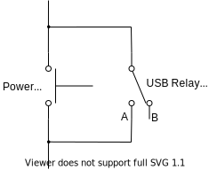

# Tutorial: Hardware Control - Adding a Power Controller

One of the key features of Pluma is the ability to turn devices on and off from within Python.

Depending on the hardware available to you the way this physically happens might be quite different, but the your code need not be.

There are many Power classes, each managing a different type of hardware. However they all inherit from the same base class `PowerBase`, meaning that they all have the same `on()`, `off()`, and `reboot()` methods.
The way you create an instance of a power class will differ depending on what it is, but the way you use it will not change.

For a full list of the supported power hardware, see [Supported Hardware](../supported-hardware.md).

## Power on and off

In this example we will be using the [IP Power 9258](https://www.aviosys.com/products/9858MT.html), a power distribution unit whose sockets can be switched on and off via HTTP requests.

```python
from pluma.core import IPPowerPDU

power = IPPowerPDU(
    port=1
    host='192.168.0.30'
)


# Turn on socket 1 of the IP Power PDU at IP address 192.168.0.30
power.on()

# Turn it off
power.off()
```

## Rebooting

Rebooting a power device works in much the same way as turning it on and off, but with one additional parameter.

The parameter `reboot_delay` specifies how many seconds to wait between turning a device off, and switching it back on again.
It is important to be able to specify this as some devices won't turn off instantly. A device with a transformer in its power supply may remain powered on for a few seconds after the power is removed. This is due to the magnetic field in the coils collapsing, providing a final bit of power to the system.
If we were to turn the device back on one second after switching off the power, the device may not have actually turned off at all!

```python
from pluma.core import IPPowerPDU

power = IPPowerPDU(
    port=1
    host='192.168.0.30',
    reboot_delay=3
)

# Turn off socket 1, wait 3 seconds, turn on socket 1
power.reboot()
```

## Send commands to power off

Sometimes you may not be able to control the board's power supply directly, or perhaps you would rather just do a soft shutdown instead.

The `SoftPower` class can help us here.

```python
from pluma.core import SoftPower, SerialConsole

console = SerialConsole(
    port='/dev/ttyUSB2'
    baud=115200
)

power = SoftPower(
    console=console,
    off_cmd='poweroff'
)

power.off()
```

This would send the command `"poweroff"` to the board's console, triggering a soft power down.

We can do much the same with rebooting too:

```python
from pluma.core import SoftPower, SerialConsole

console = SerialConsole(
    port='/dev/ttyUSB2'
    baud=115200
)

power = SoftPower(
    console=console,
    reboot_cmd='reboot'
)

power.reboot()
```

There's also an `on_cmd` option for any unusual edge cases where this might be useful.

## Pressing physical buttons

Imagine you have a system with a physical power button that must be pressed to turn it on or off.
This fictitious system requires a short press to power on, and a long press to hard power off. Your PC probably behaves like this too.

How do we go about handling this?

We can fake these button presses using the `PowerRelay` class, and a little circuit modification. Often it's enough to just clip on or solder some wires to your power button contacts, but the modification you need to make will depend on your system.

The `PowerRelay` class has `on()`, `off()`, and `reboot()` methods like any other power class, and that performs these actions by toggling the ports on a USB relay based on a sequence provided by the user.

In this scenario we are using the relay to bridge the wires connected to the system's power button as shown below:



Flipping the relay to position `A` then back to `B` is effectively the same as pressing the push button.

```python
from pluma.core import PowerRelay, USBRelay

power = PowerRelay(
    on_seq=[(1, 'A'), '200ms', (1, 'B')],
    off_seq=[(1, 'A'), '3s', (1, 'B')]
    relay=USBRelay(
        usb_device='1-1.2'
    )
)

# Press button for 200ms
power.on()

# Press button press for 3s
power.off()
```

In this example a DLP-IOR4 USB relay is connected to the Pluma host at USB path `1-1.2`. If you're not sure what this means then check out [Tutorial: USB devices](./2-2-tutorial-usb.md).

## Combining power capabilities with PowerMulti

Imagine you have a system that is powered from the mains, but also has a power button that must be pressed to start it up.
How would we go about rebooting this?

Sure, we could handle the button press using a `PowerRelay`, and turn on and off the mains using an `IPPowerPDU` or `APCPDU`, but how do we use both of these together?

The `PowerMulti` class is how. It's is a wrapper class which takes multiple other power classes and runs their on and off methods in a particular sequence.

Let's see how we'd use it to fix our power problem.

```python
from pluma.core import PowerRelay, USBRelay, IPPowerPDU, PowerMulti

power_button = PowerRelay(
    on_seq=[(1, 'A'), '200ms', (1, 'B')],
    off_seq=[(1, 'A'), '3s', (1, 'B')]
    relay=USBRelay(
        usb_device='1-1.2'
    )
)

power_socket = IPPowerPDU(
    port=1
    host='192.168.0.30',
    reboot_delay=3
)

power = PowerMulti(
    power_seq=[power_socket, '1s', power_button]
)

# Turn on power socket, wait 1s, press power button for 200ms
power.on()

# Press power button for 3s, wait 1s, turn power socket off
power.off()
```

You'll notice that by default the power off sequence is the reversed version the given `power_seq` sequence. This is probably what you want, but if not then you can set the PowerMulti parameter `reverse_off_seq` to `False`, making the off sequence play in the same order as the `power_seq`.
The default value for `reverse_off_seq` is `True`, so the power on sequence will be reversed for power off unless the parameter is specified.

```python
...


power = PowerMulti(
    power_seq=[power_socket, '1s', power_button],
    reverse_off_seq=False
)

# Turn on power socket, wait 1s, press power button for 200ms
power.on()

# Turn power socket off, wait 1s, press power button for 3s
power.off()
```

As one final example, let's make things more complicated and say that we've made the decision that we don't want to hard power off the system any more.
We need to run the shutdown command and wait 10s rather than holding the power button.

So to recap, to turn it on we want to:

1. Turn the power socket on
1. Wait 10s
1. Press the power button for 200ms

To turn it off we want to:

1. Send the console the `shutdown` command
1. Wait 10s
1. Turn the power socket off

```python
from pluma.core import PowerRelay, USBRelay, IPPowerPDU, PowerMulti, SoftPower

power_button = PowerRelay(
    on_seq=[(1, 'A'), '200ms', (1, 'B')],
    off_seq=[]
    relay=USBRelay(
        usb_device='1-1.2'
    )
    reboot_delay=5
)

power_socket = IPPowerPDU(
    port=1
    host='192.168.0.30',
    reboot_delay=3
)

power_command = SoftPower(
    console=console,
    off_cmd='shutdown',
    on_cmd=''
)

power = PowerMulti(
    power_seq=[power_socket, '10s', power_button, power_command]
)

power.reboot()
```

The equivalent function call sequence for the example above would be:

1. `power_command.off()` - Send "shutdown" command to board.
1. `power_button.off()` is called, but does nothing as `off_seq` is empty.
1. Wait 10s.
1. `power_socket.off()` - Disconnect the mains power.
1. Wait 5s - The largest delay of all of the `reboot_delay` properties of the power classes is used. In this case it comes from `power_relay`.
1. `power_socket.on()` - Reconnect the mains power.
1. Wait 10s
1. `power_command.on()` is called, but does nothing as `on_cmd` is empty.
1. `power_button.on()` - Simulate pressing the power button for 200ms.

Using the `PowerMulti` class you can handle all sorts of complicated power scenarios.

___

<< Previous: [Tutorial: USB devices](./2-2-tutorial-usb.md) |
Next: [Tutorial: Adding a storage controller](./2-4-tutorial-storage.md) >>
